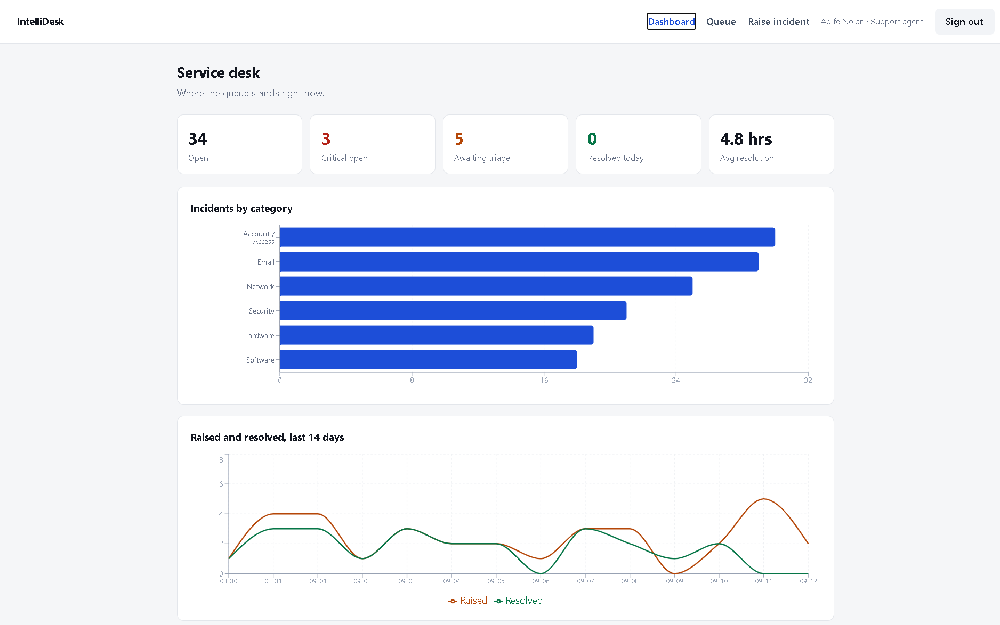
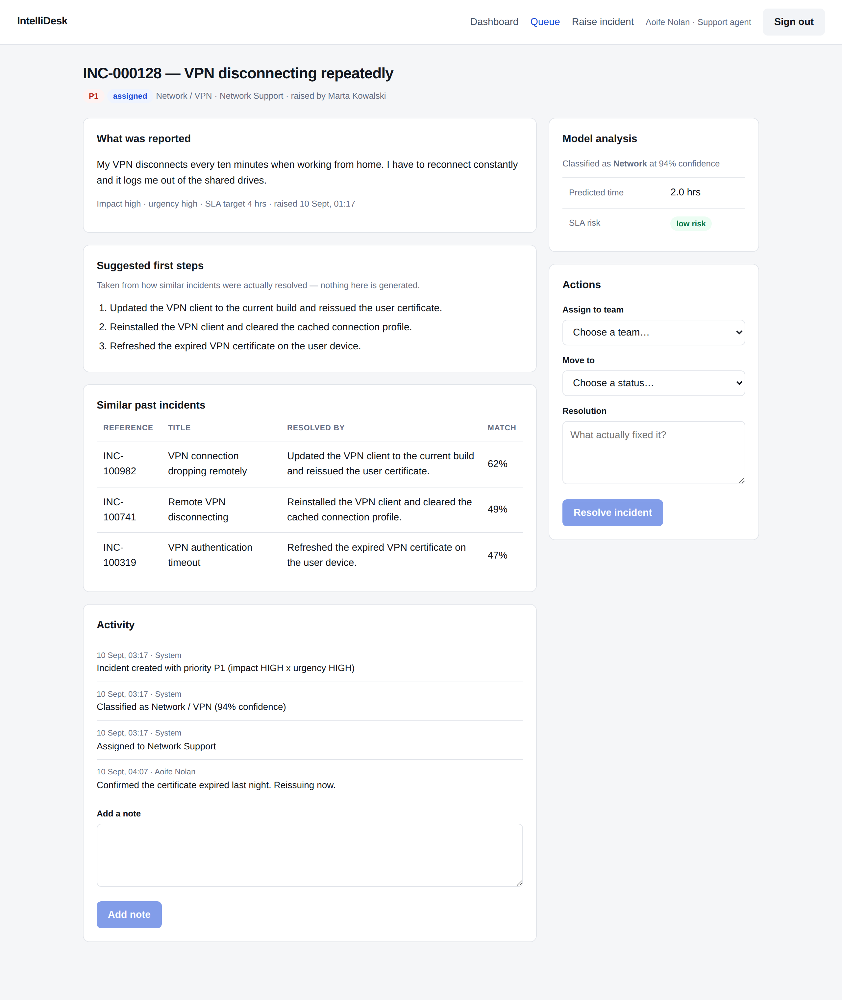
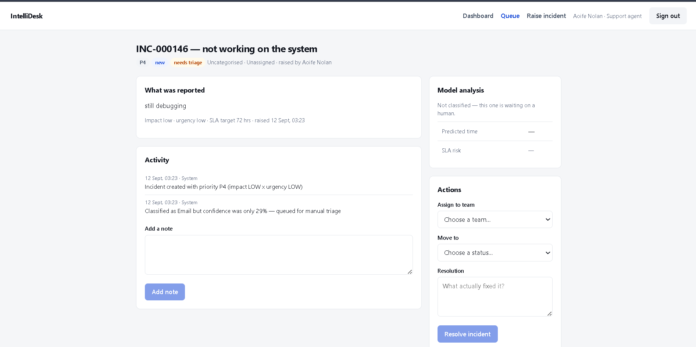

# IntelliDesk

An IT incident management platform that classifies incoming incidents, routes them,
and shows the agent how similar incidents were actually resolved.

Three services: a Spring Boot API, a React front end, and a Python ML service.

**Live: https://intellidesk-production.up.railway.app** — sign in as
`agent@intellidesk.ie` / `password123`, or raise an incident yourself and watch it get
classified, routed and matched against past tickets. The seed data is synthetic and the
app says so; see *About the training data*.

```
  React (Vite)  ──REST──▶  Spring Boot  ──HTTP──▶  Python / FastAPI
                               │                    classification
                               ▼                    similarity search
                           PostgreSQL               resolution-time model
```



An incident after triage — classified, auto-assigned, with the model's confidence and the
resolutions of the nearest past incidents shown alongside:



---

## Status

**Milestone 1 — the application.** Done. Auth and roles, incident lifecycle with
enforced status transitions, the impact × urgency priority matrix, activity trail,
agent queue with filters, and the dashboard.

**Milestone 2 — the models.** The ML service is built and trained: category
classification, similarity search over resolved incidents, and a resolution-time
model. Wire-compatible with the backend and running independently.

**Milestone 3 — deployed.** Done. Running on Railway as two services plus a managed
Postgres, built from this repo on every push to `master`.

**Not built yet:** LLM summarisation, RAG, a chatbot, Teams or email integration,
Power BI, Kubernetes. Deliberately. See *What is deliberately absent* below.

---

## Running it

### The whole stack, one command

```bash
docker compose up --build
```

Then open **http://localhost:8080**. First build takes a few minutes — Maven downloads
its dependencies and the ML service trains its model into the image.

nginx serves the built front end and proxies `/api` to the backend, so the SPA and the
API share an origin in production exactly as they do behind the Vite dev proxy. The
backend waits for Postgres to be healthy before starting; it deliberately does *not*
wait for the ML service, because incidents must still be loggable when classification
is unavailable.

### Deployed

The hosted build is a different shape on purpose. The root `Dockerfile` compiles the
React app into the Spring Boot jar, so one container serves the UI and the API from a
single origin, and the ML service runs alongside it. Two services instead of three, no
proxy in the path, and the same-origin guarantee the session cookie depends on comes
from the architecture rather than from nginx passing the Host header correctly.

The nginx setup above is what you would want in front of a CDN, where static assets
should not be served by Tomcat. For a demo, one artifact is less to run.

Environment variables the deployed backend needs:

| Variable | Example |
|---|---|
| `DATABASE_URL` | `jdbc:postgresql://host:5432/railway` — JDBC form, not the `postgresql://` URL most providers hand you |
| `DATABASE_USER` / `DATABASE_PASSWORD` | from the managed database |
| `ML_SERVICE_URL` | `http://ml.railway.internal:8000` — the ML service's address on the private network |
| `CORS_ORIGINS` | the public URL |

Two things about that private network cost more time than they should have, and both are
worth knowing before you deploy anything similar.

It is **IPv6-only**. The JVM prefers IPv4, so the backend resolves
`ml.railway.internal` to an AAAA record and then declines to use it — hence
`-Djava.net.preferIPv6Addresses=true` in the root `Dockerfile`. And uvicorn's usual
`--host 0.0.0.0` binds IPv4 only, so nothing is listening on the address the backend
finally asks for; `ml-service/Dockerfile` binds `::` instead, which is dual-stack on
Linux and so changes nothing locally.

Neither failure is loud. `MlClient` degrades to empty on any error, exactly as designed,
so an unreachable ML service looks like a healthy app in which every incident quietly
needs manual triage. The test after deploying is not "does the site load" — it is
"raise an incident and check it came back with a category".

### Or service by service, for development

You need Java 17+, Node 20+, Python 3.11+ and Postgres (or Docker).

No Maven installed? Build it in a container instead — no local Maven or JDK needed:

```bash
cd backend
docker run --rm -v "${PWD}:/app" -v "${HOME}/.m2:/root/.m2" -w /app \
  maven:3.9-eclipse-temurin-17 mvn test
```

On Windows PowerShell the same command works as written.

### 1. Database

```bash
docker compose up -d db
```

### 2. ML service

```bash
cd ml-service
python -m venv .venv && source .venv/bin/activate    # Windows: .venv\Scripts\activate
pip install -r requirements.txt
python train.py                    # generates the corpus and trains the models
uvicorn app:app --port 8000
```

`train.py` prints the holdout metrics and warns if the resolution-time model fails
to beat its baseline.

### 3. Backend

```bash
cd backend
mvn spring-boot:run
```

Seeds six teams, three demo users and 140 historical incidents on first run.

### 4. Front end

```bash
cd frontend
npm install
npm run dev          # http://localhost:5173
```

**Demo logins** — password `password123`:

| Email | Role | Sees |
|---|---|---|
| `agent@intellidesk.ie` | Support agent | Everything, plus the dashboard |
| `employee@intellidesk.ie` | Employee | Only their own incidents |

---

## How it works

### Priority is a rule, not a model

`PriorityMatrix` maps impact × urgency to P1–P4. Priority decides whose incident gets
looked at first, so it has to be explainable to the person whose ticket was ranked
below someone else's. A model that is 94% accurate is worse here than a rule that is
100% predictable. Not every decision in an ML project should be a prediction.

### The classifier is allowed to say it doesn't know

The category classifier returns a probability. Below a configurable threshold
(default 0.60) the backend refuses to route on it: the incident is flagged
`needsTriage` and lands in a human queue instead. A wrong auto-assignment is more
expensive than no assignment — it sits in the wrong team's queue being ignored,
rather than in the triage queue being looked at.

Below that threshold **nothing** derived from the model is kept — not the predicted
time, not the SLA risk, not the similar incidents. The first version stored the
neighbours anyway, reasoning that a human triaging the ticket would still want to see
them. Demoing it proved that wrong: vague text matches on one incidental word, so
"my computer is being weird" came back with neighbours at 0.41 about VPN certificates,
while a genuine match on the same corpus scored only 0.44. No threshold separates
those. The vagueness that defeats the classifier defeats the similarity search for the
same reason, so if the app won't name the category it doesn't offer the advice either.



The activity trail still records what the model thought and how sure it was —
*"Classified as Email but confidence was only 29% — queued for manual triage"* — so the
decision is auditable even though none of it was acted on.

### Suggestions are retrieved, never generated

"Suggested first steps" are the resolution notes from the nearest past incidents,
deduplicated. Every line an agent sees came from a ticket that was actually resolved
that way, and the matching incidents are shown alongside so the agent can judge for
themselves. No LLM is involved and none is needed.

### The model's advice is stored, not re-queried

What the model said at triage time is written onto the incident. When an agent opens
it a week later they see the advice it was triaged on, not whatever a retrained model
would say today. That keeps the audit trail honest.

### The service desk stays up when the model doesn't

`MlClient` degrades to empty on any failure. If the ML service is down, incidents are
still logged, still prioritised, and flagged for manual triage — and the dashboard
says so. A service desk that stops accepting tickets because a model is unavailable
is worse than one with no model at all.

### Sessions, not JWTs

The SPA is first-party. Session cookies can be revoked server-side the moment someone
leaves, and there is no token sitting in browser storage. CSRF protection is on, with
the token issued as a cookie and echoed back by the client. JWT would be the right
answer for third-party API clients; there aren't any.

---

## About the training data

**The corpus is synthetic and the app says so** — `/model-info` returns
`corpus_is_synthetic: true`.

Similarity search and resolution suggestion need past incidents that carry real
resolution text. Public IT ticket datasets almost always stop at the category label,
and the anonymised ServiceNow-style event logs have no usable free text at all. So
`generate_corpus.py` fabricates one.

It fabricates it *carefully*. A first version scored 100% holdout accuracy, which was
leakage rather than skill: every ticket was drawn from a small set of fixed sentences,
so the same string appeared in both splits. The generator now adds noise the way real
users write — dropped words, typos, inconsistent casing — and 14% of incidents are
drawn from genuinely ambiguous cases ("cannot log in to the VPN" is Network *or*
Account/Access) labelled with one of two plausible categories at random. That puts an
honest ceiling on accuracy.

Current holdout figures on 1,046 incidents:

| Metric | Value |
|---|---|
| Category accuracy | ~0.91 |
| Macro F1 | ~0.91 |
| Resolution-time MAE | 2.02 hrs |
| Baseline MAE (predict category median) | 2.51 hrs |

The most-confused pairs are Account/Access ↔ Email and Hardware ↔ Network — which are
exactly the ambiguous cases that were planted. That is the model behaving correctly,
and `/model-info` reports it rather than hiding it behind a single accuracy number.

### When the noise became the signal

The generator pads tickets the way people do — "hi,", "again -", "sorry to bother you
but", and closing lines like "I have tried restarting and it made no difference." It
makes the text look human, and it very nearly ruined the similarity search.

TF-IDF treats that padding as ordinary vocabulary, so two unrelated tickets that both
opened with "again -" scored 40% against each other. That is how a report reading
"still fixing the error" came back matched to a VPN certificate problem, with its
resolution steps offered as advice. The noise added to make the data realistic had
become the strongest feature in the model.

`strip_boilerplate()` now removes it before vectorising, at training and inference
both, and the filler words are in the stop list. With a real corpus you would derive
that list from the data rather than hard-coding it — the most frequent n-grams that
appear across every category are almost always boilerplate.

If you get hold of a real incident export, drop it in as `ml-service/data/corpus.csv`
with the same columns and delete the generator. Nothing else changes.

---

## Tests

```bash
cd ml-service && pytest        # 10 tests
cd backend && mvn test
```

The ML tests assert behaviour rather than exact numbers, so they survive a retrain:
the classifier must beat chance by a wide margin, every category must be learned (not
just the common ones), the regression must beat predicting the category median, and
suggested steps must be traceable to a real past incident. The backend tests cover the
full priority matrix, the status-transition rules, and — most importantly — that an
incident is still created when the ML service is unreachable.

---

## What is deliberately absent

No chatbot, no RAG, no vector database, no LLM resolution generation, no email or
Teams integration, no Kubernetes, no microservices beyond the one seam that earns its
place. Each of those turns this into a six-month infrastructure project before there
is anything worth showing.

The ML seam is a single HTTP contract (`MlContract.java` ↔ `schemas.py`). Swapping
TF-IDF similarity for sentence embeddings is a change inside `model.py` and nothing
else moves.

---

## Limitations

What follows is true of the thing that is actually running, as opposed to the
deliberate scope decisions above. Read it before drawing conclusions from the demo.

**The hosted demo is disposable.** It runs on a Railway trial. When the credit or the
30 days runs out the link dies, and the seeded database goes with it. Nothing is backed
up, because there is nothing in it worth backing up. Clone the repo and
`docker compose up --build` if the link is dead.

**The demo credentials are published in this README**, so anyone can sign in and change
anything. Every incident you see may have been edited by a stranger. There is no rate
limiting and no sign-in auditing — appropriate for a demo, not for anything else.

**The accuracy figures do not transfer.** ~0.91 category accuracy is measured on a
corpus this repository generates. It says the pipeline learns the structure that was
planted in the data; it says nothing about how the model would do on your tickets. On a
real export, expect worse, and expect the confidence threshold to need retuning — 0.60
was chosen against synthetic data, and the whole triage-versus-route decision hangs off
it.

**Similarity is lexical, not semantic.** TF-IDF matches shared words. "VPN
disconnecting" finds "VPN disconnects" and misses "cannot stay connected to the remote
network" entirely. An agent who gets no suggestions has not necessarily hit a novel
problem — they may have described a common one in uncommon words.

**Sessions are in memory and there is one instance.** A redeploy or a restart signs
everyone out, and the app cannot be scaled horizontally as it stands without moving
sessions to Redis or the database.

**The schema is managed by `ddl-auto: update`.** Hibernate adds columns and never
removes them, so the database drifts from the entities over time and a destructive
change is not applied at all. That is fine while the data is disposable and wrong the
moment it isn't — hence Flyway at the top of *Next*.

**The model is frozen into its image.** Retraining means rebuilding and redeploying.
That is the intended trade — it makes "what did the model say" reproducible — but it
also means corrections agents make today change nothing until someone runs a build.

---

## Next

- Flyway migrations instead of `ddl-auto: update`, before there is data worth keeping
- Sentence embeddings for similarity — TF-IDF matches "VPN disconnecting" to "VPN
  disconnects" and misses "cannot stay connected to the remote network"
- Feed agent corrections back as training labels
- A model-metrics page in the app, reading `/model-info`
- A health check on the ML seam surfaced in the UI, so "the model is down" is visible
  rather than inferred from every incident needing triage
